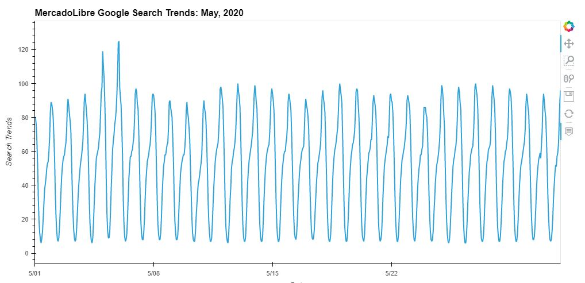
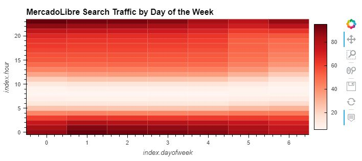
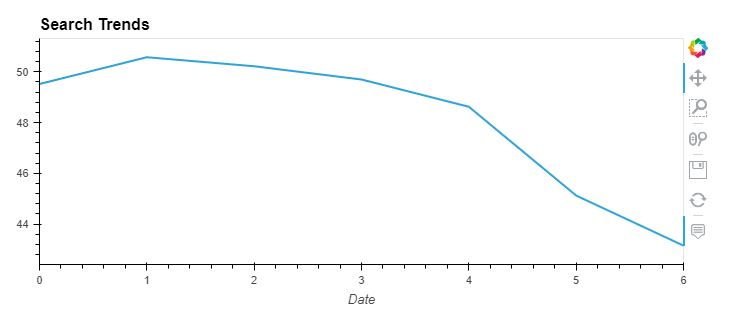
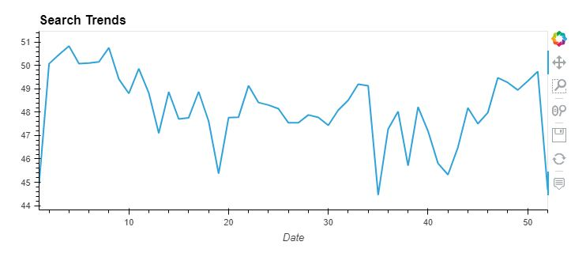
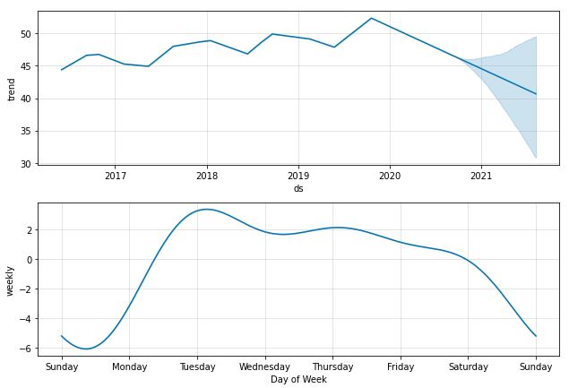
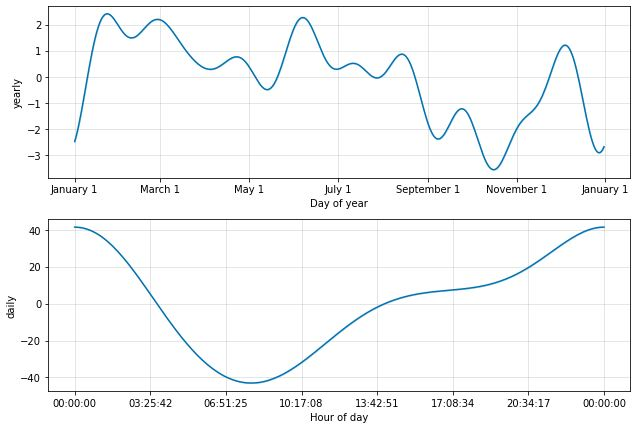

Module 11 Challenge

This project runs a time series data analysis on MercadoLibre google search traffic and sees if the results correlate with increases in stock prices.
Data is grouped by day of week, week of year, ect. to find seasonal or repeating patterns and then visualized through several different plots to help present the results as a whole.

---

## Technologies

This project uses Python 3.9.7, Google Colab, and the following libraries - 

| Library | Version | Documentation
|----|----|---|
| pandas |1.4.2| [pandas docs](https://pandas.pydata.org/docs)
| hvplot |0.8.0| [hvplot docs](https://hvplot.holoviz.org/)
| scikit-learn |1.1.1| [scikit-learn docs](https://scikit-learn.org/stable/)
| prophet| 1.1| [prophet docs](https://facebook.github.io/prophet/docs/quick_start.html)
| pystan | 3.5.0 | [pystan docs](https://pystan.readthedocs.io/en/latest/)

---

## Installation Guide

To run this program, upload the .ipynb file in [Google Colab](https://colab.research.google.com/)

---

## Usage

Several plots were used to help visualize the data results.

|
Search Trends May 2020
|
Traffic by the Hour
|
|---|---|
|

|

|
**Day of Week Traffic**
|
**Week of Year Traffic**
|
|
|
|
|
**Prophet Forecast Results**
|
**Prophet Forecast Results**
|
|
|
|
---

## Contributors

Dan McQueen

dandmcqueen@gmail.com

[Linkedin](https://www.linkedin.com/in/dan-mcqueen-4a5980238/)

---

## License

[GNU v3.0](LICENSE)
